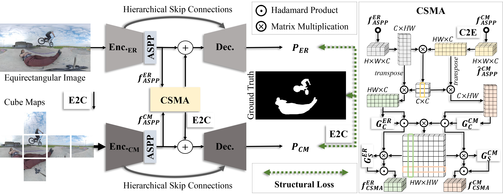
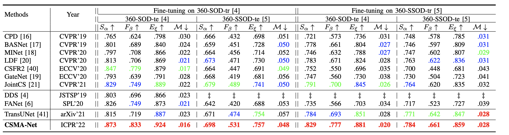
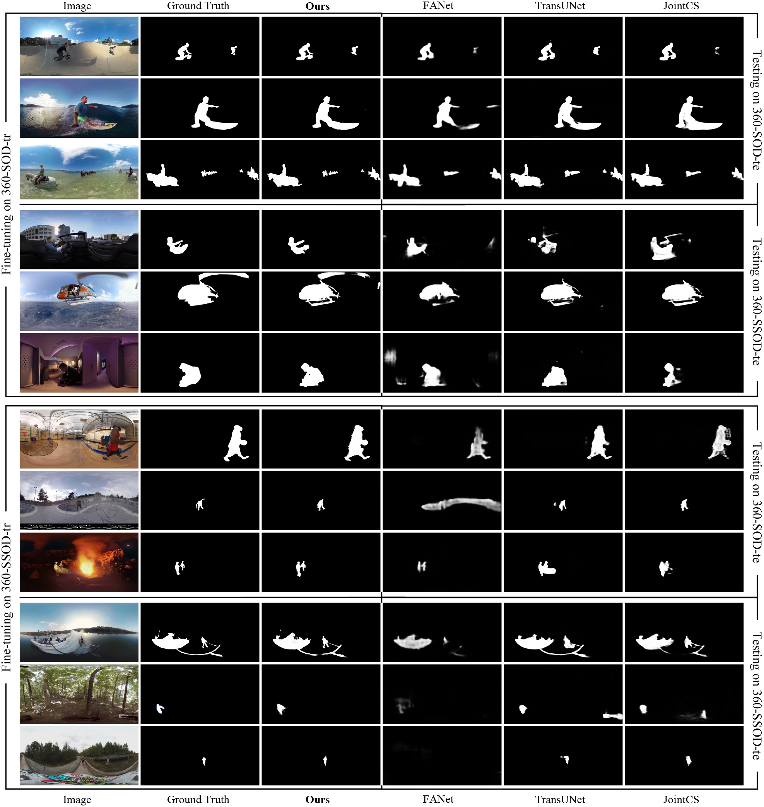

# [Channel-Spatial Mutual Attention Network for 360° Salient Object Detection (ICPR 2022)](https://drive.google.com/file/d/1h8UPIIRtUd9A6xaCqdtSdJiSVPwEoJE8/view?usp=sharing)

Authors: [*Jun-Pu Zhang (Yi Zhang)*](https://scholar.google.com/citations?user=NeHBHVUAAAAJ&hl=en), [*Wassim Hamidouche*](https://scholar.google.com/citations?user=ywBnUIAAAAAJ&hl=en), [*Olivier Deforges*](https://scholar.google.com/citations?user=c5DiiBUAAAAJ&hl=en)

------
# Introduction

      
    <em> 
    Figure 1: The architecture of our CSMA-Net. The short names in the figure are detailed as follows: CSMA = the proposed channel-spatial mutual attention
module. E2C/C2E = the projection interaction module which transforms the equirectangular (ER) image/cube maps to cube maps/ER image, respectively. ASPP = atrous spatial pyramid pooling module. Enc.ER = the hybrid-ViT-based encoder for ER image. Enc.CM = the Res2Net-based encoder for cube maps. Dec. = the decoder from RCRNet.
    </em>

In this work, we conduct 360° panoramic salient object detection by taking advantage of both the global and local visual cues of 360° images, with a novel channel-spatial mutual attention network (CSMA-Net). The key component of the CSMA-Net is the proposed CSMA module, which cascades channel-/spatial weighting-based mutual attentions. The objective of our CSMA module is to refine and fuse the bottleneck features from two separate encoders with different planar representa- tions of 360° panorama as inputs, i.e., equirectangular image and cube map. Our CSMA-Net outperforms 10 state-of-the-art segmentation methods based on the proposed 360° SOD benchmark where multiple fine-tuning and testing strategies are applied to the widely-used 360° datasets. Extensive experimental results illustrate the effectiveness and robustness of the proposed CSMA-Net. 

------
# Performance

      
    <em> 
    Figure 2: Performance comparison between CSMA-Net and the SOTAs. 
    </em>

      
    <em> 
    Figure 3: Visual results of CSMA-Net and SOTAs. Refer to "Implementation" for whole visualization.
    </em>

------
# Implementation

The source codes are available at [codes](https://github.com/PanoAsh/CSMA-Net/tree/main/codes).

The pretrained models of our CSMA-Net can be downloaded at [CSMA-Net-models](https://drive.google.com/file/d/1XKWsrcotj-1GsVRE_U7GfUXmlcP9eRS9/view?usp=sharing).

The results of our CSMA-Net on [360-SOD](http://cvteam.net/projects/JSTSP20_DDS/DDS.html) and [360-SSOD](https://github.com/360-SSOD/download) can be downloaded at [CSMA-Net-results](https://drive.google.com/file/d/1y6RRSkCWhe_ZnrnMaIdriUrKv-QKrGD_/view?usp=sharing).
